# Azure Infrastructure Lab (ARM Templates)

[](https://azure.microsoft.com/)
[](https://learn.microsoft.com/azure/azure-resource-manager/)
[]()

---

## Project Overview

This project demonstrates the deployment of a basic Azure infrastructure environment using **Azure Resource Manager (ARM) templates**.

The lab was built after earning the **Microsoft Certified: Azure Administrator Associate (AZ-104)** certification to reinforce Azure administration concepts through hands-on experience.

The goal of this project is to showcase practical Azure skills in virtual networking, virtual machines, network security, storage, and Infrastructure as Code (IaC).

This repository serves as a portfolio project demonstrating practical Azure infrastructure deployment and administration skills.

---

# Architecture

```text
                     Azure Resource Group
                              │
        ┌─────────────────────┴─────────────────────┐
        │                                           │
        │              Virtual Network              │
        │               10.0.0.0/16                 │
        │                                           │
        ├──────────────────┬────────────────────────┤
        │                  │                        │
        │                  │                        │
 Management Subnet     Workload Subnet        Storage Account
   10.0.1.0/24          10.0.2.0/24
        │                  │
        │                  │
   Windows VM          Linux VM
        │                  │
        └────── Protected by NSGs ──────┘
```

---

# Azure Services Used

- Azure Resource Groups
- Azure Virtual Network (VNet)
- Azure Subnets
- Azure Network Security Groups
- Azure Virtual Machines
  - Windows Server
  - Linux
- Azure Storage Account
- Azure Resource Manager (ARM)

---

# Skills Demonstrated

- Infrastructure as Code (IaC)
- Azure ARM Templates
- Azure Networking
- Virtual Network Design
- Subnet Configuration
- Network Security Groups
- Windows VM Deployment
- Linux VM Deployment
- Azure Storage Configuration
- Azure Resource Group Management
- Remote Administration using RDP and SSH
- Private IP Connectivity Testing
- Azure Portal Administration

---

# Environment

| Component | Configuration |
|---|---|
| Cloud | Microsoft Azure |
| Region | East US 2 |
| Infrastructure as Code | ARM Templates |
| Windows VM | Windows Server |
| Linux VM | Ubuntu Linux |
| Networking | Virtual Network and Subnets |
| Security | Network Security Groups |
| Storage | Azure Storage Account |

---

# Validation Performed

The following functionality was verified after deployment:

- Successful ARM template deployment
- Resource group creation
- Virtual network deployment
- Subnet creation and NSG association
- Windows VM deployment
- Linux VM deployment
- RDP connectivity to the Windows VM
- SSH connectivity to the Linux VM
- Private IP communication between virtual machines
- Network Security Group configuration
- Storage account deployment
- Blob container creation and file upload
- Resource dependency validation
- Azure Portal resource management

---

# Deployment Evidence and Validation

## Resource Group

The Azure resource group contains the infrastructure resources deployed during the lab.

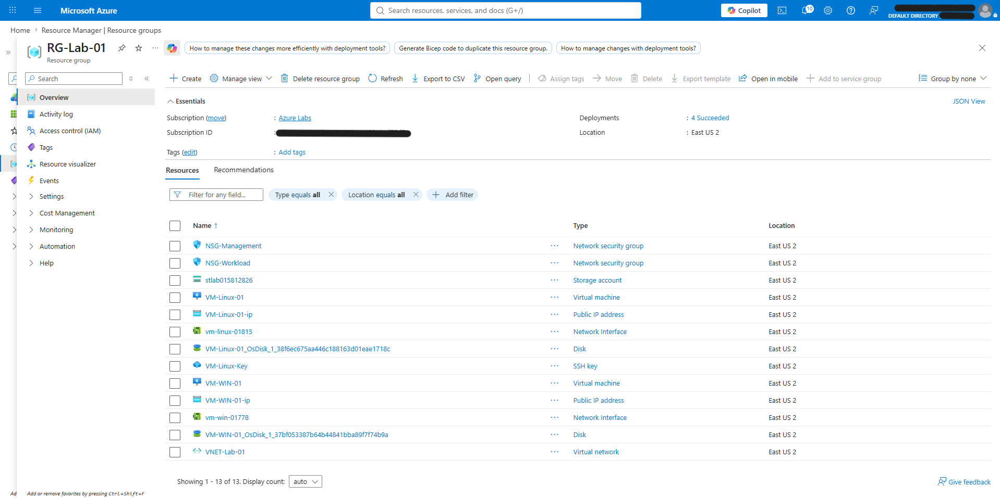

---

## Resource Visualizer

Azure Resource Visualizer displays the relationships and dependencies between the deployed resources.

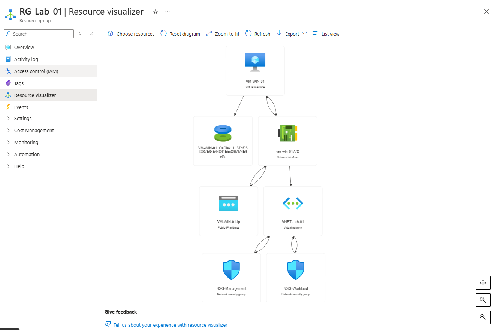

---

## Virtual Network Overview

The virtual network provides the private address space used by the Windows and Linux virtual machines.

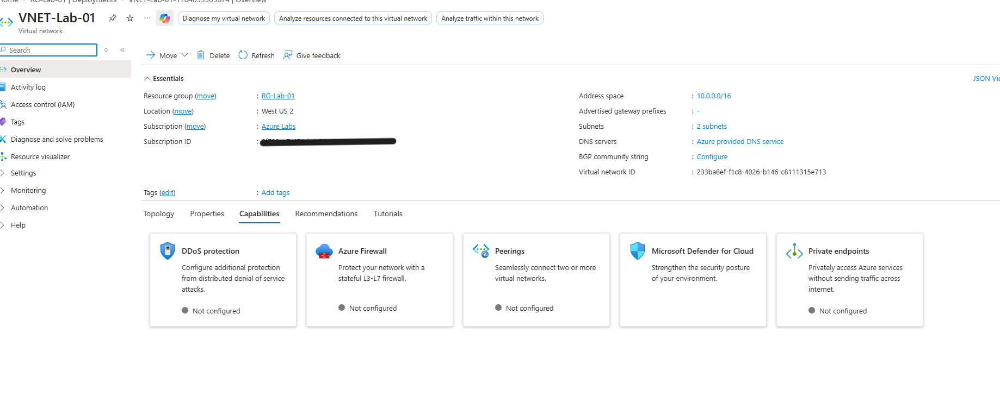

---

## Subnet and NSG Configuration

The virtual network contains separate management and workload subnets. Network Security Groups are associated with the appropriate subnets to control traffic.

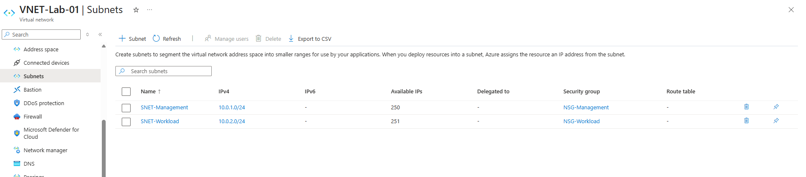

---

## Windows Virtual Machine

A Windows Server virtual machine was deployed in the management subnet.

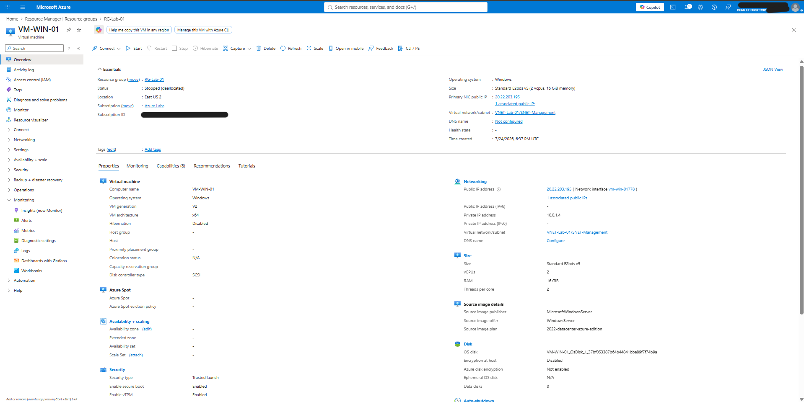

---

## Linux Virtual Machine

An Ubuntu Linux virtual machine was deployed in the workload subnet.


---

## Windows Hostname Validation

Remote Desktop was used to connect to the Windows VM and verify its hostname.

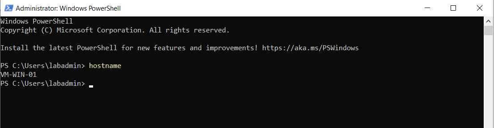

---

## Windows Network Configuration

The Windows VM network configuration was verified using `ipconfig`.

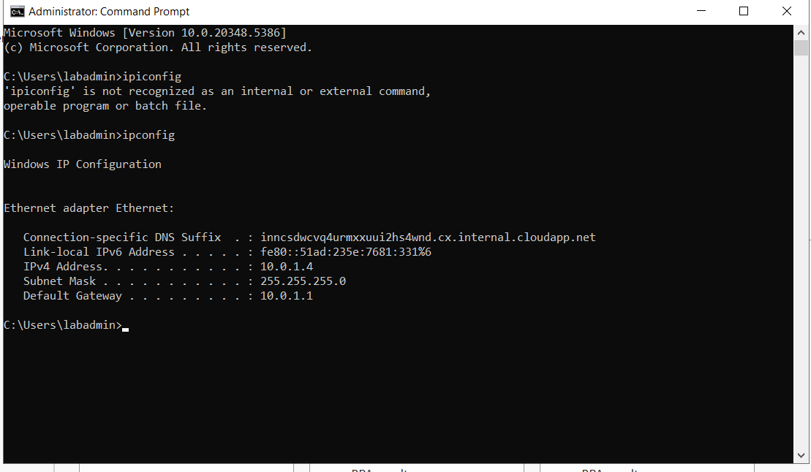

---

## Linux SSH Validation

SSH connectivity to the Linux VM was successfully established, and the system hostname and private IP configuration were verified.

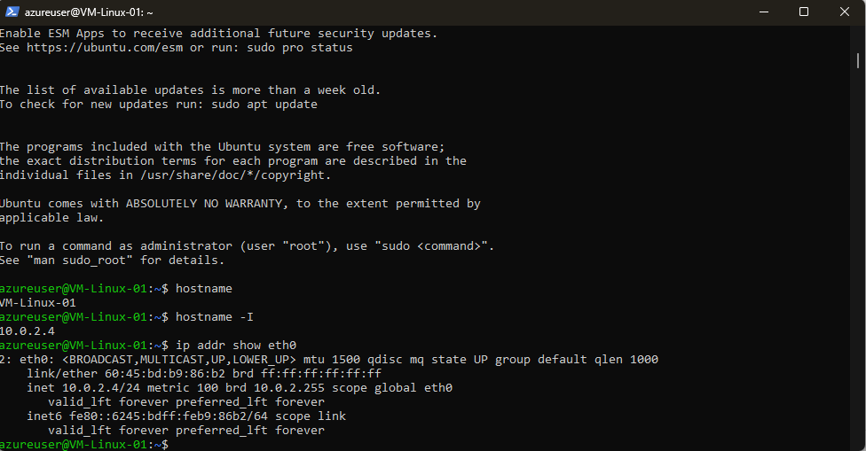

---

## Private Network Connectivity Test

Private connectivity between the Windows and Linux virtual machines was validated using ICMP traffic across the Azure virtual network.

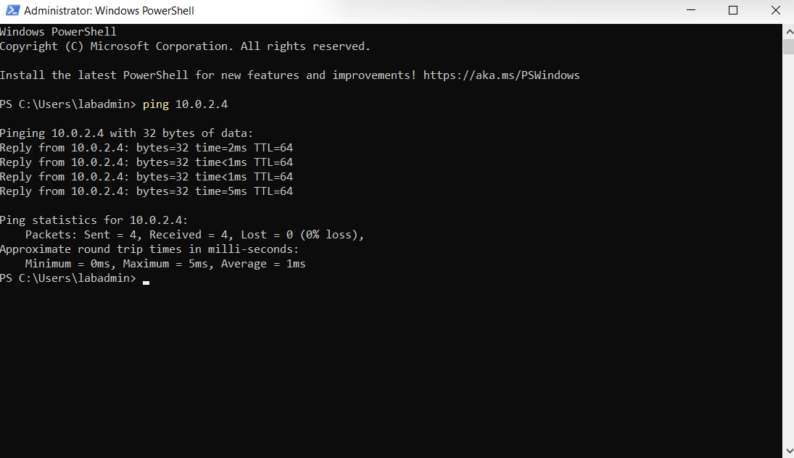

---

## Storage Account

An Azure Storage Account was deployed as part of the infrastructure environment.

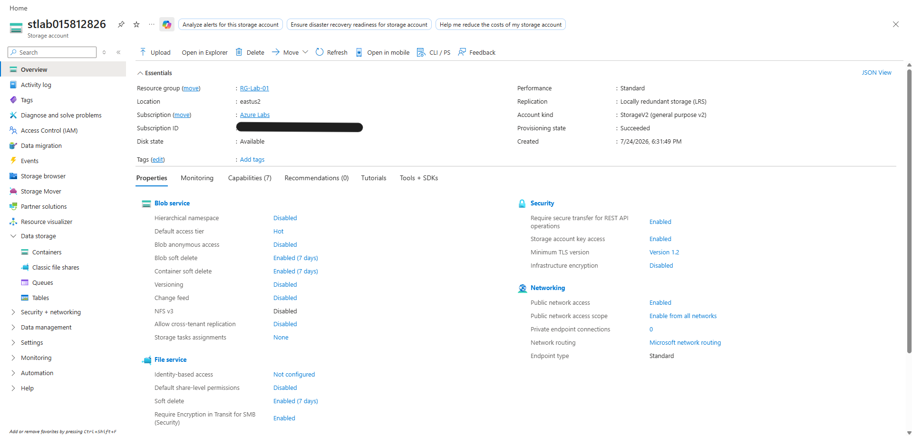

---

## Blob Storage Validation

A blob container was created and a test file was uploaded to verify that Blob Storage was functioning correctly.

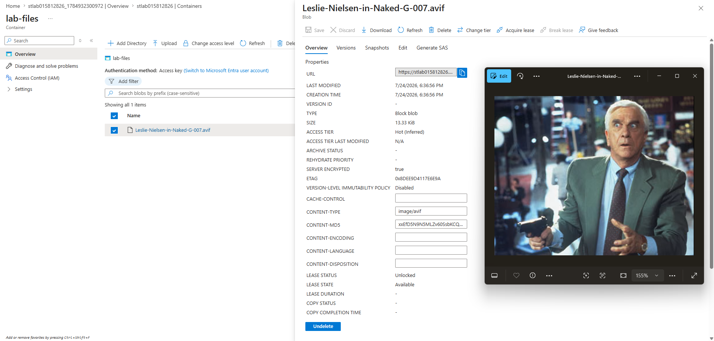

---

# Future Enhancements

Potential future enhancements include:

- Recreate the environment using Bicep
- Expand the environment with additional Azure networking and security services

---

# Learning Objectives

This project was created to gain hands-on experience with:

- Azure infrastructure deployment
- Infrastructure as Code
- Azure networking concepts
- Resource management
- Secure cloud administration
- Windows and Linux remote administration
- Cloud deployment best practices

---

# Getting Started

Clone the repository:

```bash
git clone https://github.com/dhboal/azure-infrastructure-lab.git
```

Deploy the ARM templates using:

- Azure Portal
- Azure CLI
- PowerShell

> **Note:** This project uses sample infrastructure created in a personal Azure subscription. No credentials, secrets, or other sensitive information are included in this repository.

---

# Education

**Bachelor of Science in Cybersecurity and Information Assurance**  
Western Governors University (WGU)

---

# Certifications

- Microsoft Certified: Azure Administrator Associate (AZ-104)
- CompTIA CySA+
- CompTIA Security+
- CompTIA PenTest+
- ITIL 4 Foundation
- CompTIA Project+
- CompTIA Network+
- CompTIA A+

---

# Author

**David Boal**

Cybersecurity | Cloud Security | Cloud Administration

GitHub: https://github.com/dhboal

---

## License

This project is licensed under the MIT License.
